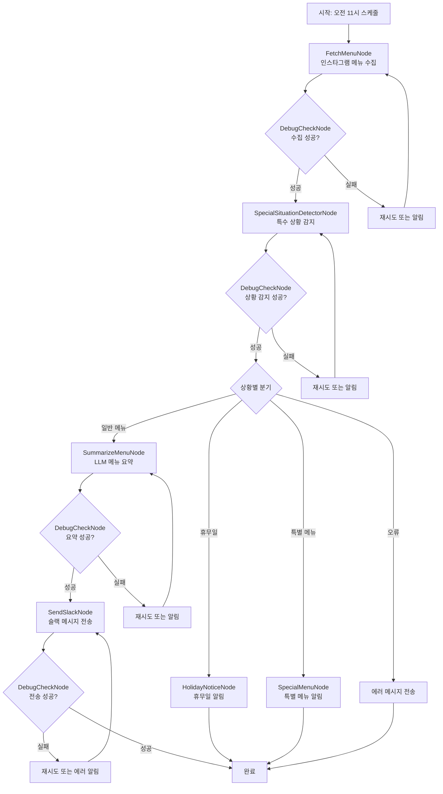

# Design Doc: 구도 한식뷔페 메뉴 알림 시스템

> 매일 오전 11시에 인스타그램에서 오늘의 메뉴를 가져와서 슬랙으로 자동 전송하는 시스템

## Requirements

### 주요 기능
- **자동 메뉴 수집**: 매일 오전 11시에 구도 한식뷔페 인스타그램(@sunaedong_buffet)에서 최신 메뉴 정보를 수집
- **특수 상황 감지**: 휴무일, 특별 메뉴, 영업 중단 등 특수 상황을 자동으로 감지
- **지능형 요약**: LLM을 활용하여 메뉴 정보를 읽기 쉽게 요약 및 정리
- **상황별 알림**: 일반 메뉴, 휴무일, 특별 메뉴에 따라 적절한 알림 전송
- **슬랙 자동 알림**: 요약된 메뉴를 지정된 슬랙 채널로 자동 전송
- **디버그 및 모니터링**: 각 단계별 실행 상태를 확인하고 문제 발생 시 디버그 정보 제공

### 사용자 스토리
1. **팀원으로서** 매일 아침 슬랙에서 오늘의 뷔페 메뉴를 확인하고 싶다
2. **팀원으로서** 휴무일이나 특별 메뉴가 있을 때도 적절한 알림을 받고 싶다
3. **관리자로서** 시스템이 정상적으로 작동하는지 모니터링하고 싶다
4. **개발자로서** 문제 발생 시 빠르게 디버깅할 수 있는 정보가 필요하다

## Flow Design

### Applicable Design Pattern:

1. **Workflow**: 메뉴 수집 → 상황 감지 → 상황별 처리 → 전송의 순차적 파이프라인
2. **Agent**: 상황 감지에서 각 상황에 따른 적절한 액션 결정
3. **Conditional Branching**: 상황에 따라 다른 처리 경로로 분기

### Flow high-level Design:

1. **FetchMenuNode**: 인스타그램에서 최신 포스트의 메뉴 정보를 크롤링
2. **SpecialSituationDetectorNode**: LLM을 사용하여 특수 상황(휴무일, 특별 메뉴 등)을 감지
3. **상황별 분기 처리**:
   - **HolidayNoticeNode**: 휴무일 알림 전송
   - **SpecialMenuNode**: 특별 메뉴 알림 전송
   - **SummarizeMenuNode**: 일반 메뉴 요약
4. **SendSlackNode**: 요약된 메뉴를 슬랙 채널로 전송
5. **DebugCheckNode**: 각 단계의 성공/실패 상태를 확인하고 필요시 재시도 또는 알림



## Utility Functions

1. **Call LLM** (`utils/call_llm.py`)
   - *Input*: prompt (str)
   - *Output*: response (str)
   - 상황 감지, 메뉴 요약, 알림 메시지 생성에 사용

2. **Instagram Scraper** (`utils/instagram_scraper.py`)
   - *Input*: instagram_url (str)
   - *Output*: latest_post_content (str)
   - FetchMenuNode에서 인스타그램 최신 포스트 수집

3. **Slack Sender** (`utils/slack_sender.py`)
   - *Input*: message (str), channel (str)
   - *Output*: success_status (bool)
   - 모든 슬랙 메시지 전송에 사용

4. **Scheduler** (`utils/scheduler.py`)
   - *Input*: cron_expression (str), function
   - *Output*: None
   - 매일 오전 11시 워크플로우 실행

## Node Design

### Shared Store

```python
shared = {
    "config": {
        "instagram_url": "https://www.instagram.com/sunaedong_buffet/",
        "slack_channel": "#gudo",
        "debug_mode": True
    },
    "menu_data": {
        "raw_content": "",
        "extracted_menu": "",
        "summary": "",
        "situation_analysis": {}
    },
    "status": {
        "fetch_success": False,
        "summarize_success": False,
        "send_success": False,
        "situation_detected": False,
        "holiday_notice_sent": False,
        "special_menu_sent": False,
        "last_run": None,
        "error_log": []
    }
}
```

### Node Steps

1. **FetchMenuNode**
  - *Purpose*: 인스타그램에서 최신 메뉴 포스트를 수집하고 텍스트 추출
  - *Type*: Regular Node (with retry on failure)
  - *Steps*:
    - *prep*: shared["config"]["instagram_url"] 읽기
    - *exec*: instagram_scraper 유틸리티로 최신 포스트 크롤링 및 메뉴 텍스트 추출
    - *post*: shared["menu_data"]["raw_content"]에 저장, status 업데이트

2. **SpecialSituationDetectorNode**
  - *Purpose*: 수집된 메뉴 정보를 분석하여 특수 상황(휴무일, 특별 메뉴 등)을 감지
  - *Type*: Regular Node (with retry on failure)
  - *Steps*:
    - *prep*: shared["menu_data"]["raw_content"] 읽기
    - *exec*: LLM 호출하여 상황 분석 (휴무일, 특별 메뉴, 영업시간 변경 등)
    - *post*: shared["menu_data"]["situation_analysis"]에 저장, 상황에 따른 액션 반환

3. **HolidayNoticeNode**
  - *Purpose*: 휴무일 상황일 때 적절한 휴무일 알림을 생성하고 전송
  - *Type*: Regular Node (with retry on failure)
  - *Steps*:
    - *prep*: shared["menu_data"]["situation_analysis"]와 shared["config"]["slack_channel"] 읽기
    - *exec*: LLM 호출하여 휴무일 알림 메시지 생성 후 슬랙 전송
    - *post*: shared["status"]["holiday_notice_sent"] 업데이트

4. **SpecialMenuNode**
  - *Purpose*: 특별 메뉴 상황일 때 특별 메뉴 알림을 생성하고 전송
  - *Type*: Regular Node (with retry on failure)
  - *Steps*:
    - *prep*: shared["menu_data"]["situation_analysis"], shared["menu_data"]["raw_content"], shared["config"]["slack_channel"] 읽기
    - *exec*: LLM 호출하여 특별 메뉴 알림 메시지 생성 후 슬랙 전송
    - *post*: shared["status"]["special_menu_sent"] 업데이트

5. **SummarizeMenuNode**
  - *Purpose*: 일반 메뉴 상황일 때 추출된 메뉴 정보를 LLM으로 읽기 쉽게 요약
  - *Type*: Regular Node (with retry on failure)
  - *Steps*:
    - *prep*: shared["menu_data"]["raw_content"] 읽기
    - *exec*: LLM 호출하여 메뉴 요약 (한국어, 카테고리별 정리)
    - *post*: shared["menu_data"]["summary"]에 저장, status 업데이트

6. **SendSlackNode**
  - *Purpose*: 요약된 메뉴를 슬랙 채널로 전송
  - *Type*: Regular Node (with retry on failure)
  - *Steps*:
    - *prep*: shared["menu_data"]["summary"]와 shared["config"]["slack_channel"] 읽기
    - *exec*: slack_sender 유틸리티로 메시지 전송
    - *post*: shared["status"]["send_success"] 업데이트

7. **DebugCheckNode**
  - *Purpose*: 각 단계별 실행 상태 확인 및 디버그 정보 제공
  - *Type*: Regular Node
  - *Steps*:
    - *prep*: shared["status"] 전체 읽기
    - *exec*: 현재 단계의 성공/실패 판단, 필요시 로그 생성
    - *post*: 다음 액션 결정 ("success", "retry", "fail")

## 특수 상황 감지 로직

### 감지 가능한 상황들:

1. **휴무일 (holiday)**
   - 키워드: "휴무", "휴점", "쉬는날", "영업안함", "문닫음", "오늘휴무"
   - 액션: `holiday_notice` → HolidayNoticeNode

2. **특별 메뉴 (special_menu)**
   - 키워드: "특별메뉴", "이벤트", "한정메뉴", "시즌메뉴"
   - 액션: `special_notice` → SpecialMenuNode

3. **영업시간 변경 (business_hours_change)**
   - 키워드: "영업시간변경", "시간조정", "오늘만"
   - 액션: `normal` → 일반 메뉴 처리

4. **일반 메뉴 (normal)**
   - 기본 상황: 정상적인 메뉴 정보
   - 액션: `normal` → SummarizeMenuNode

5. **오류 상황 (error)**
   - 분석 불가능한 상황
   - 액션: `error_notice` → 에러 메시지 전송

### LLM 분석 결과 형식:

```json
{
    "situation_type": "normal|holiday|special_menu|business_hours_change|error",
    "confidence": 0.0-1.0,
    "detected_keywords": ["키워드1", "키워드2"],
    "summary": "상황 요약",
    "action_required": "normal|holiday_notice|special_notice|error_notice"
}
```

## 테스트 기능

### 테스트 모드들:

1. **일반 테스트**: `python main.py --test`
   - 더미 데이터로 전체 플로우 테스트

2. **휴무일 테스트**: `python main.py --holiday-test`
   - 휴무일 상황 시뮬레이션 테스트

3. **특별 메뉴 테스트**: `python main.py --special-test`
   - 특별 메뉴 상황 시뮬레이션 테스트

4. **즉시 실행**: `python main.py --now`
   - 실제 인스타그램에서 데이터를 가져와서 실행

5. **환경변수 체크**: `python main.py --check`
   - 필요한 API 키들이 설정되어 있는지 확인

