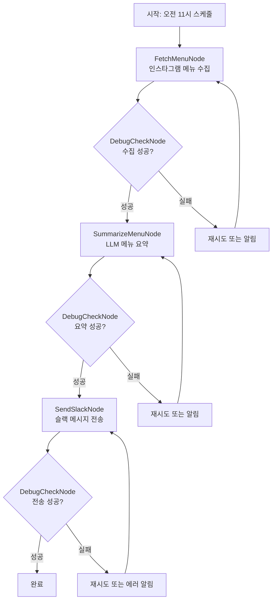

# Design Doc: 구도 한식뷔페 메뉴 알림 시스템

> 매일 오전 11시에 인스타그램에서 오늘의 메뉴를 가져와서 슬랙으로 자동 전송하는 시스템

## Requirements

### 주요 기능
- **자동 메뉴 수집**: 매일 오전 11시에 구도 한식뷔페 인스타그램(@sunaedong_buffet)에서 최신 메뉴 정보를 수집
- **지능형 요약**: LLM을 활용하여 메뉴 정보를 읽기 쉽게 요약 및 정리
- **슬랙 자동 알림**: 요약된 메뉴를 지정된 슬랙 채널로 자동 전송
- **디버그 및 모니터링**: 각 단계별 실행 상태를 확인하고 문제 발생 시 디버그 정보 제공

### 사용자 스토리
1. **팀원으로서** 매일 아침 슬랙에서 오늘의 뷔페 메뉴를 확인하고 싶다
2. **관리자로서** 시스템이 정상적으로 작동하는지 모니터링하고 싶다
3. **개발자로서** 문제 발생 시 빠르게 디버깅할 수 있는 정보가 필요하다

## Flow Design

### Applicable Design Pattern:

1. **Workflow**: 메뉴 수집 → 요약 → 전송의 순차적 파이프라인
2. **Agent**: 디버그 모드에서 각 단계별 상태 확인 및 재시도 결정

### Flow high-level Design:

1. **FetchMenuNode**: 인스타그램에서 최신 포스트의 메뉴 정보를 크롤링
2. **SummarizeMenuNode**: LLM을 사용하여 메뉴 정보를 한국어로 정리 및 요약
3. **SendSlackNode**: 요약된 메뉴를 슬랙 채널로 전송
4. **DebugCheckNode**: 각 단계의 성공/실패 상태를 확인하고 필요시 재시도 또는 알림



## Utility Functions

1. **Call LLM** (`utils/call_llm.py`)
   - *Input*: prompt (str)
   - *Output*: response (str)
   - SummarizeMenuNode에서 메뉴 요약에 사용

2. **Instagram Scraper** (`utils/instagram_scraper.py`)
   - *Input*: instagram_url (str)
   - *Output*: latest_post_content (str)
   - FetchMenuNode에서 인스타그램 최신 포스트 수집

3. **Slack Sender** (`utils/slack_sender.py`)
   - *Input*: message (str), channel (str)
   - *Output*: success_status (bool)
   - SendSlackNode에서 슬랙 메시지 전송

4. **Scheduler** (`utils/scheduler.py`)
   - *Input*: cron_expression (str), function
   - *Output*: None
   - 매일 오전 11시 워크플로우 실행

## Node Design

### Shared Store

```python
shared = {
    "config": {
        "instagram_url": "https://www.instagram.com/sunaedong_buffet/",
        "slack_channel": "#lunch-menu",
        "debug_mode": True
    },
    "menu_data": {
        "raw_content": "",
        "extracted_menu": "",
        "summary": ""
    },
    "status": {
        "fetch_success": False,
        "summarize_success": False,
        "send_success": False,
        "last_run": None,
        "error_log": []
    }
}
```

### Node Steps

1. **FetchMenuNode**
  - *Purpose*: 인스타그램에서 최신 메뉴 포스트를 수집하고 텍스트 추출
  - *Type*: Regular Node (with retry on failure)
  - *Steps*:
    - *prep*: shared["config"]["instagram_url"] 읽기
    - *exec*: instagram_scraper 유틸리티로 최신 포스트 크롤링 및 메뉴 텍스트 추출
    - *post*: shared["menu_data"]["raw_content"]에 저장, status 업데이트

2. **SummarizeMenuNode**
  - *Purpose*: 추출된 메뉴 정보를 LLM으로 읽기 쉽게 요약
  - *Type*: Regular Node (with retry on failure)
  - *Steps*:
    - *prep*: shared["menu_data"]["raw_content"] 읽기
    - *exec*: LLM 호출하여 메뉴 요약 (한국어, 카테고리별 정리)
    - *post*: shared["menu_data"]["summary"]에 저장, status 업데이트

3. **SendSlackNode**
  - *Purpose*: 요약된 메뉴를 슬랙 채널로 전송
  - *Type*: Regular Node (with retry on failure)
  - *Steps*:
    - *prep*: shared["menu_data"]["summary"]와 shared["config"]["slack_channel"] 읽기
    - *exec*: slack_sender 유틸리티로 메시지 전송
    - *post*: shared["status"]["send_success"] 업데이트

4. **DebugCheckNode**
  - *Purpose*: 각 단계별 실행 상태 확인 및 디버그 정보 제공
  - *Type*: Regular Node
  - *Steps*:
    - *prep*: shared["status"] 전체 읽기
    - *exec*: 현재 단계의 성공/실패 판단, 필요시 로그 생성
    - *post*: 다음 액션 결정 ("success", "retry", "fail")

